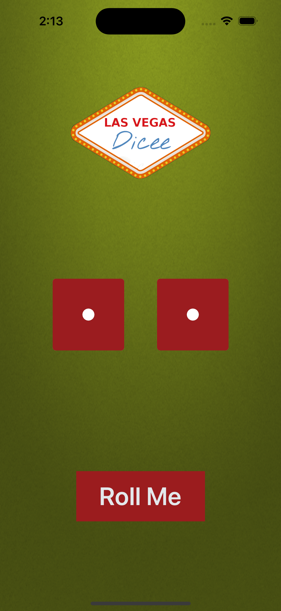

# Dicee 🎲

Dicee is a dice-rolling app developed as part of Section 4 in Angela Yu's iOS Development Bootcamp on Udemy. The app allows users to roll two dice with a tap of a button, generating random results for both dice. The primary focus of this project was learning **Auto Layout** to create responsive designs suitable for all screen sizes.

## Features
- 🎲 Tap to roll two random dice
- 💡 Simple and intuitive UI
- 📱 Fully responsive design using Auto Layout
- 🛠 Built with Swift and UIKit

## Purpose
This project was a part of Section 4 of the Udemy course, where I learned to:
- Implement **Auto Layout** to adapt the UI across various devices and orientations
- Work with **randomization** to simulate dice rolls
- Enhance my understanding of **UI components** like `UIImageView`, `UIButton`, and `UILabel`
- Practice **basic project structure** and code organization in Swift

## Screenshots

## Tech Stack
- Swift
- UIKit
- Auto Layout

Built as part of the [Udemy iOS Development Bootcamp](https://www.udemy.com/course/ios-13-app-development-bootcamp) by Angela Yu.

